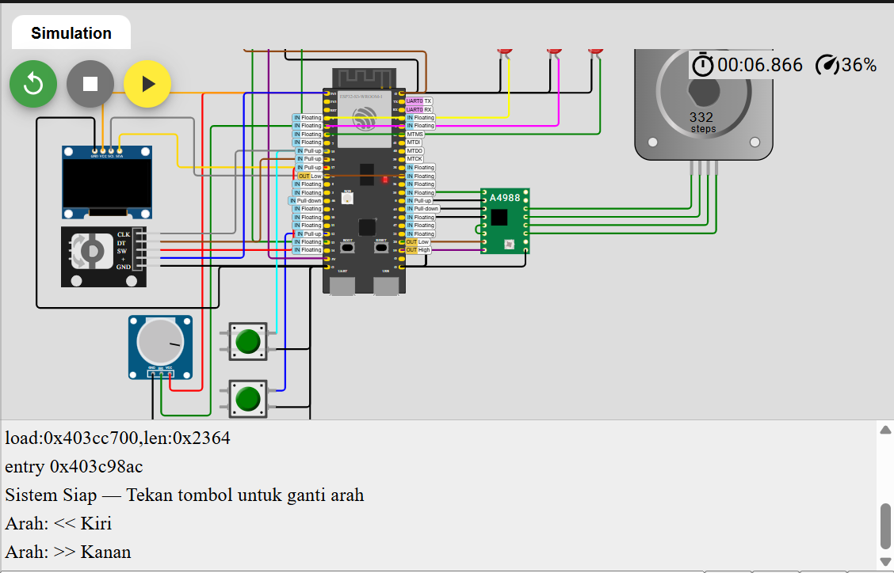

Dual Core Stepper

📘 Deskripsi  
Percobaan ini menggunakan dua core pada ESP32-S3 untuk menggerakkan motor stepper secara paralel menggunakan FreeRTOS.

Program menggunakan 2 task:
| Task            | Core | Fungsi                         | Keterangan                                |
| --------------- | ---- | ------------------------------ | ----------------------------------------- |
| **TaskStepper** | 1    | Menjalankan pergerakan stepper | Gerakan halus dengan `stepper.run()`      |
| **TaskControl** | 0    | Mengatur arah otomatis         | Ubah arah saat posisi mencapai 0 atau 800 |

Motor stepper bergerak bolak-balik antara posisi 0–800 step secara otomatis.

🔌 Mapping Hardware
| Komponen | Pin ESP32-S3 | Mode   | Core |
| -------- | ------------ | ------ | ---- |
| STEP_PIN | 18           | Output | 1    |
| DIR_PIN  | 19           | Output | 1    |
| EN_PIN   | 20           | Output | 1    |

🧪 Langkah Percobaan
| No | Langkah                    | Hasil yang Diharapkan                                                |
| -- | -------------------------- | -------------------------------------------------------------------- |
| 1  | Upload program ke ESP32-S3 | Serial Monitor menampilkan log inisialisasi task dan sistem          |
| 2  | Amati motor stepper        | Motor bergerak dari posisi 0 → 800 step → kembali ke 0               |
| 3  | Lihat log Serial Monitor   | Muncul teks `>> Berubah ke arah KIRI` dan `<< Berubah ke arah KANAN` |
| 4  | Ulangi pengamatan          | Motor terus bergerak bolak-balik secara otomatis tanpa jeda panjang  |

🧠 Penjelasan Kerja  
Core 1 menjalankan pergerakan motor agar halus.  
Core 0 memantau posisi dan mengubah arah jika batas tercapai.  

🎥 Video Demo

